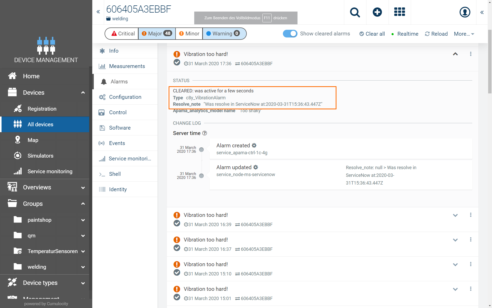

# Cumulocity microservice for incident managment in ServiceNow

This project is a microservice for managing incidents in SerivceNow. When an alarm in Cumulocity is created the microservice creates a resulting incident. When the incident is resolved the corresponing alarm in Cumulocity is cleared.
This allows to work in an efficient manner in a IT Service Managent Platform ServiceNow and link it to Cumulocity.
Potential use cases are:
- Extend IT Service Management and Help Desk in cumulocity

For this demo a Cumulocity tenant and a ServiceNow instance are required. For a free trial tenant you can register [here](https://www.softwareag.cloud/site/product/cumulocity-iot.html#/).


# Content
1. [Overview](#overview-of-features)
2. [Prepare project](#prepare-project)
3. [Deploy microservice](#deploy-microservice)
4. [Register callback in ServiceNow](#register-callback-in-serviceNow)  
5. [Demo Scenario](#demo-scenario)  


## Overview of features

The microservice is written in NodeJS. New Cumulocity alarms generate incidents in ServiceNow. When the incident is resolved the correponding Cumulocity alarm is cleared.


[back to content](#content)

## Prepare project 

1. Clone git repository
```
git clone https://github.com/SoftwareAG/cumulocity-microservice-servicenow.git
```

2. Update proerties in `.env`

The following properties in `.env` have to updated afetr you created a ServiceNow instance.
```
SERVICENOW_USER=***
SERVICENOW_PASSWORD=***
SERVICENOW_INSTANCENAME=***
```

## Deploy microservice

Before you deploy the microservice you have to download the script `microservice` from [here](https://bitbucket.org/m2m/cumulocity-examples/src/develop/microservices/scripts/microservice). Further documentation is available on the [Cumulocity Developer Site](https://cumulocity.com/guides/microservice-sdk/concept/#ms-utility-tool).  
In order to deploy the microservice run:

```
$ cd docker
$ microservice pack deploy subscribe -n node-ms-servicenow -u <CUMULOCITY_USER> -p <CUMULOCITY_PASSWORD> -te <CUMULOCITY_TENANT> -d "https://<CUMULOCITY_TENANT>.eu-latest.cumulocity.com"
```

[back to content](#content)
		
## Register callback in ServiceNow

1. Login to ServiceNow instance, open `Business Rules`, in Left Navigation  

2. Create new Business Rule `Call Cumulocity`
  

3. Enter setting as marked on screenshot  
* Choose Table -> Incident
* Advanced -> checked
* On tab When to run -> after, Update  

 

* On tab Advanced copy the following code:  

```
(function executeRule(current, previous /*null when async*/) {
	
	try {
		var request = new sn_ws.RESTMessageV2();
		request.setEndpoint('https://<CUMULOCITY_TENANT>.cumulocity.com/service/node-ms-servicenow/incident');
		request.setHttpMethod('POST');
		
		var user = "***";
		var password = "***";
		var string = {};
		
		request.setBasicAuth(user,password);
		request.setRequestHeader("Accept","application/json");
		
		string.u_short_description = current.getValue('short_description');
		string.u_impact = current.getValue('impact');
		string.u_urgency = current.getValue('urgency');
		string.u_state = current.getValue('state');
		string.u_number = current.getValue('number');
		var u_updated_by = current.getValue('sys_updated_by');
		string.u_updated_on = current.getValue('sys_updated_on');
		string.u_updated_name = (' ' + resolveName(u_updated_by)).slice(1);
		
		var myJSON = JSON.stringify(string);
		
		request.setRequestHeader('Content-Type','application/json');
		request.setRequestBody(myJSON);
		var response = request.execute();
		gs.log('test: '+response.getBody());
		
	} catch(err) {
		gs.log('Orange Error: ' + err);
	}
	
})(current, previous);


function resolveName (updated_by) {
		var gr = new GlideRecord('sys_user');
		gr.addQuery('user_name', updated_by);
		gr.query();
		if(gr.next()) {
			return gr.first_name;
		}
}
```
[back to content](#content)

## Demo Scenario

1. Create alarm in Cumulocity
2. Resolve corresponding incident in ServiceNow  


3. View cleared alarm in Cumulocity  

  

[back to content](#content)
______________________
These tools are provided as-is and without warranty or support. They do not constitute part of the Software AG product suite. Users are free to use, fork and modify them, subject to the license agreement. While Software AG welcomes contributions, we cannot guarantee to include every contribution in the master project.	
______________________
For more information you can Ask a Question in the [TECHcommunity Forums](http://tech.forums.softwareag.com/techjforum/forums/list.page?product=cumulocity).

You can find additional information in the [Software AG TECHcommunity](http://techcommunity.softwareag.com/home/-/product/name/cumulocity).
_________________
Contact us at [TECHcommunity](mailto:technologycommunity@softwareag.com?subject=Github/SoftwareAG) if you have any questions.
